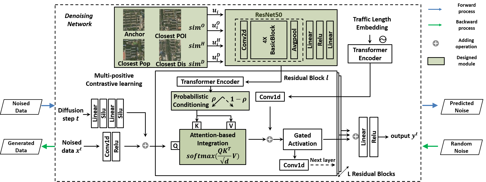

# OpenDiff-diffusion-model-with-open-data-source

This project was initially described in the full Applied Data Science Track paper "Diffusion Model-based Mobile Traffic Generation with Open Data for Network Planning and Optimization", at 30th SIGKDD Conference on Knowledge Discovery and Data Mining (KDD 2024) in Barcelona, Spain. Contributors to this project are from the [Future Intelligence laB (FIB)](https://fi.ee.tsinghua.edu.cn/) at [Tsinghua University](https://www.tsinghua.edu.cn/).

# Installation

1. Tested OS: Linux
2. Python >= 3.7
3. PyTorch == 1.10.1
4. Tensorboard

# Model Training

You should first run main.py in the multi_positive_CL folder to get a feature-extraction model, which is saved as 'fnal_dict_xxxx.pth'.

Then, you can use the well-trained model to obtain the embeddings of regional features, which are saved in 'region_embeding_xxx.txt'.

After acquiring the embeddings, you can run the exe_traffic.py in the diffusion_model folder to implement our Opendiff model.

# Model Training

The implementation is based on [CSDI](https://github.com/ermongroup/CSDI)

If you found this library useful in your research, please consider citing:

Haoye Chai, Tao Jiang, and Li Yu. 2024. Diffusion Model-based Mobile Traffic Generation with Open Data for Network Planning and Optimization. In Proceedings of the 30th ACM SIGKDD Conference on Knowledge Discovery
and Data Mining (KDD ’24), August 25–29, 2024, Barcelona, Spain. ACM, New York, NY, USA, 11 pages. https://doi.org/10.1145/3637528.3671544
